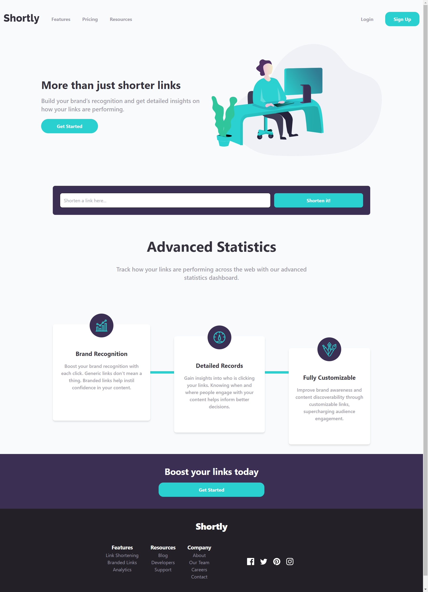

# URL Shortening

This is a single landing page, to add an API in the future.
I'll add some validation to the form, to know that the user will add a valid URL

## Tools
  

    
    
    
    
    
    
    
    
  

   
    
  ## LINK

  [Link to the deployed website](https://beautiful-gecko-9f01b3.netlify.app/)

  ## PREVIEW

  
